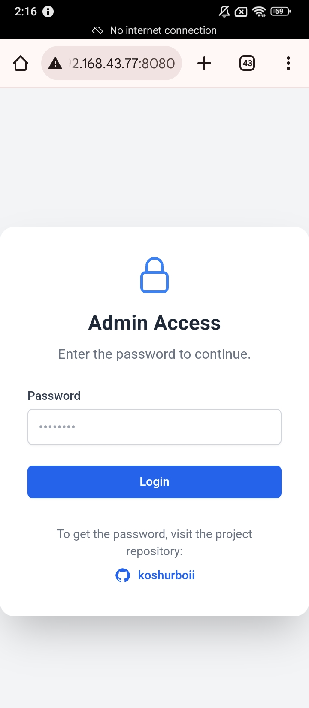

# PrefsHooker
A DEX module for Android APKs. Inject it into any app to start a local HTTP server that lets you view and edit SharedPreferences remotely via a browser. Perfect for APK modding, DEX injection, Android reverse engineering, and testing app preferences.

## Features
- View, edit, add, or delete **SharedPreferences** keys and values in real-time.
- Works on any app after DEX injection.
- Accessible from **any device on the same network** (Wi-Fi or hotspot).
- Browser-based interface – no need for additional apps or ADB commands.
- Lightweight and efficient, with minimal impact on the host app.
## PrefsHooker Preview 

| Preview 1 | Preview 2 | Preview 3 | Preview 4 |
|-----------|-----------|-----------|-----------|
|  |  |  |  |

| Preview 5 | Preview 6 | Preview 7 | Preview 8 |
|-----------|-----------|-----------|-----------|
|  |  |  |  |

| Preview 9 | Preview 10 | Preview 11 | Preview 12 |
|-----------|------------|------------|------------|
|  |  |  |  |


 ## How It Works

1. **Decompile the APK** using your preferred tool (e.g., MT Manager).  
2. **Inject** the file `classic<series_number>.dex` into the target APK.  
   *(Replace `<series_number>` with the actual DEX number you are using.)*  
3. **Invoke the Smali code** from the `LauncherActivity` to start the `PrefsHooker` service:  
   ```smali
   # Place this code inside the onCreate() method
   
   sget-object v0, Lkoshurboii/PrefsHooker/ۦۢۥ;->ۥ:Lkoshurboii/PrefsHooker/ۦۢۥ;
    invoke-virtual {v0}, Lkoshurboii/PrefsHooker/ۦۢۥ;->ۥ()V
   ```  
4. **Save your changes** and rebuild the APK.  
5. **Open the app**; a persistent notification will appear, indicating that the server has started.  
   > **Note:** For Android 11+ devices, make sure to add the `POST_NOTIFICATIONS` permission in the manifest.  
6. **Click on "Open in Browser"** from the notification.  
   It will redirect you to your browser (Chrome recommended) where you can view and edit SharedPreferences remotel.
<details>
  <summary>Click to reveal password</summary>

  **Password:** `abrar123`  
When opening in the browser, it will ask you for the password useuse it. 

</details>

   *Alternatively, you can watch the tutorial for a complete step-by-step walkthrough.*

---
##  Other Projects You Might Find Interesting

| [](https://github.com/koshurboii/Injected-Root-Files-Manager) | [](https://github.com/koshurboii/Device-Linker) |
|---|---|
| **Injected Root Files Manager** — An advanced tool that lets developers access private app folders on non-rooted Android devices, integrating seamlessly into APKs for security testing purposes. | **Device Linker** — A secure and efficient platform for managing personal devices in real time, featuring seamless synchronization, a unified control panel, and authentication via referral codes. |


---
## 🤝 Connect with Me & Support

Stay in touch or follow for updates, tutorials, and more:

| [](https://instagram.com/koshurboii) | [](https://t.me/koshurboii) | [](https://www.linkedin.com/in/koshurboii) | [](https://t.me/koshurboiiyt) |
|---|---|---|---|

---

⭐ **If you like this project, don’t forget to give it a star on GitHub!**

---

## Disclaimer

This project is created to help you easily **modify and manage your own apps** for testing and development purposes. It is intended for personal or educational use only. These tools are designed for educational, testing, and personal use **only**, and the author is **not responsible** for any misuse, including but not limited to:  

- Unauthorized access to applications or data  
- Reverse engineering apps without permission  
- Violating privacy, security, or intellectual property laws  

By using these tools, you agree to use them responsibly and comply with all applicable laws. **Do not use them for illegal activities.**
